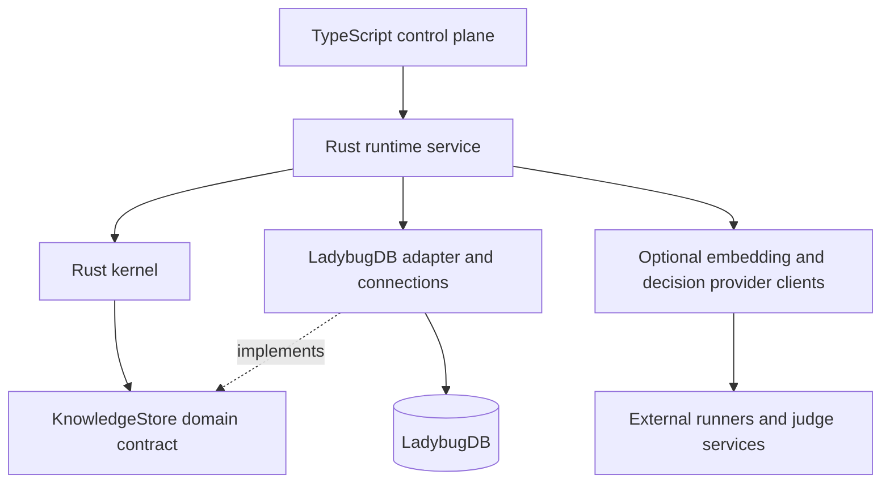

# OXIDE architectural specification

## Status and authority

- Status: **Draft architectural source of truth for the proposed rewrite**.
- Architectural generation: **OXIDE v2**. This is not a SemVer release designation and implies no dependency on reaching v0.2.
- Date: 2026-10-07.
- Top-level decision: [ADR-0001](../adr/0001-oxide-v2-rewrite.md), **Proposed**.
- Future implementation instructions: [BOOTSTRAP.md](../BOOTSTRAP.md).

This document specifies the intended architecture of a clean rewrite on the separate branch `rewrite/v2`. It does not authorize implementation in the documentation session. The existing implementation is historical evidence and a source of benchmarks, fixtures, regressions, and proven behavior; its module layout and APIs are not the rewrite template.

For rewrite work, follow this specification and Accepted ADRs when they conflict with legacy structure. Proposed ADRs are reviewable proposals, not silently Accepted decisions. Before implementation, resolve any conflict between this specification and an Accepted ADR through a documented amendment. Technology findings below are documentation observations, not OXIDE integration measurements.

**MUST** states a correctness or boundary requirement. **SHOULD** states a preferred approach whose exception needs an explicit reason. **MAY** identifies an optional experiment. Names and conceptual operations describe contracts; they are not final Rust signatures, package names, or a transport protocol.

## Mission

> OXIDE transforms repository structure into task-specific context.

Given repository state, a developer or agent query, and a context budget, OXIDE produces a small, structurally coherent, high-value context bundle for the task. Software agents consume that evidence; OXIDE remains agent-agnostic and is not itself an autonomous coding agent.

Retrieval finds entry points; routing finds context. Retrieval produces candidates, never the final bundle. Search asks, “What resembles this query?” OXIDE asks, “What information must the downstream agent see to solve this task?” TreeRouter explores worthwhile structural regions; deterministic selection and packing turn the resulting evidence into context. Similarity scores alone cannot answer the second question.

## Product definition

> OXIDE is an open-source context engine for agents.

> OXIDE indexes repository knowledge into a structural TreeIndex and routes each task through that structure to construct a bounded, high-value ContextBundle for software agents.

TreeIndex and TreeRouter are foundational architecture, including in offline/no-model operation. TreeIndex represents repository knowledge structurally; lexical/vector retrieval supplies useful entry points; TreeRouter evaluates which structural regions are worth exploring under deterministic Rust policy. ContextPacker constructs the final bounded output. These are architectural concepts, not commitments to a specific tree schema or routing algorithm.

OXIDE is agent-agnostic: integrations adapt inputs and deliver output without changing repository intelligence for a particular agent. Its primary operation is conceptually:

`build_context(repository_snapshot, query, query_context, context_budget) -> ContextBundle`

A repository snapshot describes captured source, including relevant uncommitted state when requested; a Git commit alone does not identify a dirty worktree. Query context may include explicitly supplied paths, symbols, editor selection, or change scope. These are typed task inputs, not agent-specific objects.

The output contains bounded source evidence with entity identity, repository-relative path, source range, snapshot provenance, and inclusion reasons. It reports budget accounting, omitted evidence, and relevant degradation or incompleteness. It does not answer the coding task or claim that the evidence is exhaustive.

Ranked search MAY be exposed as a candidate inspection operation. It MUST remain distinct from context construction. OXIDE can improve context without changing candidate ranking, and can improve ranking without improving final context.

## Non-goals

OXIDE is not a coding LLM, autonomous coding agent, LSP replacement, vector database product, code generator, whole-repository RAG system, or general-purpose reasoning engine. It does not edit source or execute repository code to solve a query. Complete compiler-level resolution for every language is not a bootstrap requirement.

The initial rewrite does not include old SQLite migration compatibility, preservation of accidental public APIs, immediate support for every historical integration, mandatory learned inference/JEV/semantic embeddings, unrestricted graph traversal, a distributed database/service architecture, or a full model-serving stack.

## First principles

1. **Structure before similarity. Code is a graph, not a bag of chunks.** TreeIndex represents structural regions over entities and typed relationships; a tree/forest projection preserves access to non-tree relationships.
2. **Retrieval finds entry points; routing finds context.** Retrieval produces candidates, never final context directly. TreeRouter is foundational; every bundle passes through deterministic inclusion policy and packing.
3. **Structure is first-class.** Definitions, containment, imports, references, calls, implementations, and tests retain identity and provenance.
4. **Models judge; deterministic Rust decides.** Judges estimate value. No model controls traversal rules, thresholds, inclusion guarantees, budget, or fallback.
5. **Uncertainty is useful output.** Unknown, abstained, unavailable, and rejected are different states.
6. **Source-derived runtime state is reproducible.** Rebuild the knowledge model from captured source and versioned derivation inputs; caches are disposable.
7. **The ML/runtime boundary is typed and narrow.** Models receive bounded capsules and return validated judgments, never database handles or executable plans.
8. **Every stage is independently testable and measurable.** Stage artifacts support isolated replay and ablations.
9. **Agents consume context; OXIDE remains agent-agnostic.** The Rust kernel has no MCP, VS Code, CLI presentation, agent, or product-integration knowledge.
10. **TypeScript does not reimplement repository intelligence.** Retrieval, graph construction, selection, source evidence shaping, and packing remain Rust responsibilities.
11. **Every feature has an information/decision/metric hypothesis.** State what information it adds, which decision it improves, and which metric should move before admitting it.
12. **Baselines are first-class.** Experimental paths do not erase simple controls or their measured results.
13. **Learned components are optional.** Indexing and context construction work offline without embeddings or a learned decision model, using deterministic lexical/structural retrieval and heuristic decisions.
14. **OXIDE owns context engineering, not model serving.** OXIDE owns provider contracts, identities, requests, caching, fallback, and context semantics; external runners execute inference.
15. **Models and model runners are replaceable infrastructure.** Discovery does not change a configured provider/model; changes are explicit, persisted, and invalidate incompatible derived state.

## System architecture

The conceptual stack is:

```text
TypeScript Control Plane
          ↓ typed service boundary
Rust Runtime
          ↓ domain operations
Rust Kernel
          ↓ KnowledgeStore port
LadybugDB (initial adapter)
```

This is a responsibility stack, not a requirement that the kernel link LadybugDB. Dependency inversion is mandatory: the kernel defines domain-facing ports; the runtime and its adapters implement them and own their resources.



Begin as a **modular monolith**. Kernel and runtime responsibilities MUST be separable in dependencies and tests; that does not require many crates. A kernel library and runtime host are legitimate compilation/API boundaries. Additional crates or TS packages need a demonstrated compilation, reuse, runtime, or API reason. Neither giant undifferentiated modules nor a microcrate per concept is acceptable.

### Boundary ownership

| Concern | Owner | Boundary rule |
| --- | --- | --- |
| Domain types, parsing semantics, relation resolution, TreeIndex construction, entry-point fusion | Kernel | Operates on typed data and domain ports |
| TreeRouter, candidate graphs/capsules, inclusion policy, expansion rules, ContextPacker | Kernel | Same behavior across all integrations; routing is not optional |
| Filesystem capture, watchers, DB connections, provider calls | Runtime | I/O behind kernel-defined contracts |
| Repository/provider client sessions, request batching, scheduling, caches, cancellation, telemetry | Runtime | Owns orchestration, not inference execution or selection policy |
| MCP, editor/agent adapters, configuration UI, CLI/application presentation | TS control plane | Calls typed runtime operations |
| Storage queries, row conversion, physical indexes, native IDs | Storage adapter | Private to runtime infrastructure |
| Embedding/model execution, weights, inference hardware and serving lifecycle | External runners / judge services | Replaceable backends; not an OXIDE-owned model-serving stack |

## Kernel

The kernel owns the repository domain model and correctness-critical behavior: parsing/indexing orchestration, language-independent TreeIndex construction, entry-point retrieval, TreeRouter, structural operations, candidate graph and capsule construction, deterministic selection, expansion, budgeting, and ContextPacker.

“Orchestration” here means deciding which domain work and invalidation are required. Runtime code performs file reads, persists batches, schedules jobs, and invokes provider clients. External runners execute inference. The kernel consumes captured source and typed results; it does not open connections, spawn application processes, download weights, or interpret CLI/MCP options.

Kernel invariants:

- No database-native types, Cypher, protocol/tool envelopes, or presentation objects in public domain APIs.
- Pure transformations SHOULD be separated from operations that use ports. Unit tests MUST run without a database, editor, MCP server, model, or network.
- Required algorithmic limits, stable order, score meanings, and evidence provenance are domain policy.
- Parsing failure does not masquerade as an empty, successfully understood file. Unsupported/partial results carry diagnostics.
- Parser and relation extraction SHOULD share a parse where compatible; compile grammar queries once per version/session rather than per file. Do not promise one parse for incompatible substrates without measuring it.
- Language adapters normalize facts into common entities/relations. They MUST distinguish syntactic evidence from resolved relationships and retain ambiguous/unresolved references.

## Runtime

The Rust runtime hosts repository sessions and owns OXIDE resources: database instances/connections, embedding/decision provider clients, request batching, caches, concurrency, scheduling, I/O, and telemetry. Provider sessions mean client/request state, not resident model weights or an inference server. External runners own inference execution and its serving resources. Runtime executes kernel operations through typed ports and exposes a service boundary to TS.

Conceptual service operations include opening/closing a repository session, capturing/indexing a snapshot, inspecting status/capabilities, retrieving candidates for diagnostics, building context, and cancelling an operation. No arbitrary SQL/Cypher service operation is required. Successful results and errors MUST be versioned typed contracts; consumers must not parse CLI prose.

Each request pins one published snapshot and one effective configuration. Runtime MUST prevent a request from mixing source, entities, relationships, lexical data, or vectors from incompatible generations. Readers see a complete published snapshot or an explicit error/degraded capability; unfinished writes are not silently exposed as current knowledge.

The initial runtime ownership plan is one read/write database owner per store, with connections created from that owner. Concurrent CLI/editor/MCP clients MUST attach through the runtime or receive a clear ownership conflict; TS must not independently open that database. Whether the service uses a persistent child process, native binding, or another local transport remains open. Do not freeze a native binding or daemon because the legacy implementation used one.

Runtime MUST bound queued work and memory, support cancellation/deadlines, serialize publication, and invalidate snapshot-dependent caches. Cache keys include snapshot, query inputs, derivation versions, embedding/decision identity, and policy versions as applicable. Session limits and scheduler implementation require measurement.

### Embedding providers and model-runner boundary

> OXIDE owns context engineering, not model serving.

OXIDE owns typed provider contracts, persisted provider/model and embedding-space identity, batching/request orchestration, caches, compatibility validation, fallback, and retrieval/routing/selection semantics. External runners own inference execution, model loading, weights, device scheduling, and model-serving lifecycle. The runtime does not aim to embed a full model-serving stack.

Initial local embedding adapters SHOULD target **Ollama** and **llama.cpp**. These are preferred runner boundaries, not frozen endpoints, model choices, or guaranteed API compatibility. Adapter validation must establish model identity, supported embedding semantics, batch behavior, dimensions, normalization, timeouts, and error handling at pinned runner versions.

At startup or configuration time, runtime MAY perform bounded discovery of configured/known local runner endpoints. TS presents available capabilities and setup choices. Detection is advisory: it does not select a model, install weights, start a serving stack, send repository source, or enable semantic inference automatically. Avoid unrestricted host/port scanning.

If semantic embeddings are not configured, continue with lexical entry points and structural TreeRouter exploration, report semantic capability as **unavailable**, and optionally offer setup choices. Missing semantics is a supported mode, not an invalid repository state. No learned model or runner is required for indexing or context construction.

Once a provider/model is configured, persist its explicit identity. A newly detected runner MUST NOT change that selection; an unavailable selected runner causes visible degradation, not an automatic switch to another provider/model. Explicit reconfiguration validates identity and invalidates/rebuilds incompatible vectors. Mutable runner model aliases require a digest/revision/compatibility check where supported; unresolved identity is reported rather than assumed stable. Endpoint discovery, configured identity, observed health, and snapshot vector readiness are distinct states.

**Sentence Transformers** MAY serve as a research/reference implementation for training, validation, or compatibility tests; it is not assumed as the production Rust runtime. Native inference remains a future option only if benchmarks justify it and a focused decision defines the exception. No native execution dependency enters bootstrap by default.

### Failure contract

| Condition | Required behavior |
| --- | --- |
| Missing published snapshot | Typed unavailable/index-required result; no fabricated empty success |
| Changed worktree during capture | Retry boundedly or return capture conflict; do not publish mixed bytes |
| Unsupported or partially parsed file | Preserve file evidence and explicit coverage diagnostics |
| Semantic provider unavailable, malformed vector, or incompatible space | Deterministic lexical/structural fallback with visible semantic-unavailable status |
| Decision timeout, bad schema, missing candidate, abstention | Heuristic judgment for affected candidates, with reason |
| Knowledge store corruption or publication failure | Fail closed for affected snapshot; retain last valid snapshot when safe, otherwise require rebuild |
| Zero valid candidates | Valid empty bundle with reasons and accounting |
| Tiny/zero budget | Empty or smaller valid bundle; never exceed budget to force an item |

Fallback MUST NOT relabel old vectors as belonging to another provider. Failure to construct an explicitly requested provider is observable; a documented query fallback may continue without that channel. Never silently compare different spaces or persist substitute vectors under the original identity.

## TypeScript control plane

TS owns MCP, CLI/application UX where appropriate, VS Code/editor and agent integrations, workspace orchestration, process lifecycle, configuration UX, remote/service adapters, and SDKs. It translates integration inputs into typed service requests and renders returned bundles/errors.

TS MAY collect an editor selection or user-selected roots and offer provider/runner setup choices. Rust validates scope, persists configured identities, and interprets their repository meaning. TS MUST NOT parse source for repository intelligence, implement TreeIndex/TreeRouter or graph traversal, fuse rankings, derive capsules, apply relevance thresholds, choose context items, truncate source to fit budgets, or read LadybugDB directly. Display filtering must not silently become a second selector.

Remote integrations transport validated Rust results; they do not introduce a second repository engine. The kernel has no knowledge of the identity or workflow of the downstream agent.

## Repository knowledge model

### Identity and snapshots

| Type | Meaning and invariant |
| --- | --- |
| `RepoId` | OXIDE repository namespace, independent of DB identity and absolute checkout location |
| `SnapshotId` | Captured source-state identity; commit plus dirty/untracked content and scope must be distinguishable |
| `DerivationId` | Versioned derivation identity for a source snapshot; parser/schema/provider changes distinguish read views and cache entries |
| `FileId` | Domain file identity within a repository; normalization and case rules are explicit |
| `SymbolId` | Domain declaration identity supporting overloads, nesting, and duplicate names |
| `EntityId` | Typed union for repository/module/file/symbol and any justified extra category |
| Structural region identity | Domain reference to a TreeIndex region, scoped to snapshot/derivation and projection version; not a DB-native tree/node ID |
| `RepositorySnapshot` | Immutable source manifest, derivation manifest, publication status, and capability/coverage information |
| `Query` / `QueryContext` | Task text and explicit path/symbol/change hints; validated Rust domain inputs independent of an integration's objects |
| `ContextBudget` | Nonnegative payload-token allowance plus the declared counting contract; separate from retrieval/traversal resource limits |

IDs MUST be deterministic for the same identity inputs and namespace version, collision-safe, and unrelated to database allocation order. They MUST NOT be LadybugDB `InternalID`, table offsets, SQLite row IDs, or legacy FNV IDs by default. File/symbol IDs are always interpreted with repository and snapshot scope. Cross-snapshot rename/move continuity is not guaranteed; the identity algorithm and snapshot-identity inputs are proposed in [ADR-0010](../adr/0010-domain-identity-and-source-capture.md) (Proposed). Any future continuity is a separate derived key, never entity identity.

Logical source-state identity is distinct from derivation identity. The same source snapshot may be re-derived with a different parser/model/schema. A manifest records both, and caches and publication keys include the derivation version. The adapter MUST reject ambiguous lookups of multiple derivations.

Source references use repository-relative paths, canonical byte ranges, source digests, and snapshot identity. Human line ranges are derived views with a documented convention. Byte-exact attribution is needed for same-line declarations and nested spans; line-only matching is insufficient.

Source hydration MUST return the bytes matching the pinned source digest. Runtime may retain captured bytes or use another verified source provider; reading the current worktree without digest verification is invalid. Unavailable historical bytes produce an explicit stale/unavailable-source state, never a snippet from a different snapshot. Captured-source retention and garbage collection must respect active read views.

### Entities

| Category | Intended role |
| --- | --- |
| Repository | Root namespace and repository metadata |
| Module | Language/build namespace, independent of file identity; one file need not equal one module |
| File | Source unit, language, digest, path, parse/coverage status |
| Symbol | Declaration/definition with name, signature, kind, owner, source range, and provenance |
| Test | Explicit test role attached to a symbol/file; do not duplicate source identity just to add a test category |
| Chunk (optional) | Bounded source region only for a demonstrated need such as unsupported text or oversized entities; anchored to an owner/range |

Whether tests become dedicated nodes or typed facets remains open. The domain MUST expose test identity/role consistently regardless of physical schema. Chunks MUST NOT replace symbols as the fundamental selection unit or fragment structure solely for vector indexing. Documentation/configuration can initially be file evidence; richer categories require an information/decision/metric justification.

### Relations

All relations have typed endpoints, snapshot/derivation scope, extraction/resolution provenance, and source evidence where available.

| Relation | Direction and semantics |
| --- | --- |
| `CONTAINS` | Repository/module/file/scope → owned child; physical and logical containment distinguishable |
| `DEFINES` | File or defining scope → symbol declared/defined there |
| `REFERENCES` | Source entity → referenced target; resolved references are distinguished from ambiguous target evidence |
| `CALLS` | Caller symbol/file scope → called symbol; narrower than generic reference |
| `IMPORTS` | Importing module/file/scope → imported module/entity |
| `IMPLEMENTS` | Implementing symbol → contract/interface symbol; do not conflate inheritance without declaring that semantics |
| `TESTED_BY` | Production entity → test entity/role, with strength/provenance of association |

Inverse lookup is an operation, not a requirement to duplicate edges. Unresolved target names live as typed unresolved reference evidence; do not invent a resolved endpoint. Multiple possible endpoints may be retained with ambiguity. A name coincidence or same directory MUST NOT be recorded as a proven call or test dependency.

The repository graph may contain cycles. Only ownership containment is intended to be acyclic within its declared hierarchy. Selection must terminate on cyclic calls/imports, missing targets, and high-degree nodes.

### Indexing and publication

The source manifest defines included files, ignores, languages, byte digests, and captured dirty/untracked scope. Runtime captures immutable bytes; kernel extraction and resolution produce a validated write batch. Index construction is resumable/discardable but publication is atomic from a reader's perspective.

An edit invalidates source-dependent entities, relations, snippets, lexical features, and vectors as needed. Deletes remove stale facts from the next snapshot. A symbol's body digest is distinct from its identity. Full rebuild and incremental derivation MUST converge to equivalent logical knowledge for identical source/manifests; database byte layout need not match.

An initial full-rebuild implementation is acceptable before incremental indexing. Incremental indexing is a required later validation milestone, not a reason to import old migrations.

## TreeIndex

TreeIndex is the structural representation of repository knowledge used by TreeRouter from the first implementation slice. It organizes repository/module/file/symbol scopes and useful structural regions with source identity, coverage, and relation provenance. It is derived from the same published snapshot as the underlying entities and graph, not a separate source of repository truth.

Code remains a graph. A hierarchical tree/forest view provides navigation while imports, references, calls, implementations, and tests retain their typed cross-edges. Do not delete cycles/non-tree relationships or invent a single-parent ownership fact to fit a convenient schema. The exact hierarchy/projection, treatment of multiple ownership views, region granularity, and persisted/materialized representation remain open. “TreeIndex” does not mandate a particular tree database, schema, path encoding, or vendor library.

TreeIndex invariants:

- Region/entity/source references are domain-owned and scoped to repository, snapshot, derivation, and projection version.
- Traversable hierarchy/projection is finite and cycle-safe; cross-edges remain typed and provenance-bearing.
- Structural regions expose bounded identity, membership/adjacency, coverage, and source evidence. A heuristic directory grouping is not a compiler-proven module or call relation.
- Parsing, scope exclusions, source digests, and unresolved references have the same meaning as in the knowledge model. Partial structure is explicit.
- Rebuild/incremental publication updates TreeIndex consistently with entities/relations; no request uses an old projection with new source.
- Lexical/vector accelerators point to domain entities/regions in TreeIndex, rather than defining its hierarchy. TreeIndex works without vectors or a judge.

KnowledgeStore provides typed facts and bounded region/adjacency access; kernel owns projection semantics. Whether regions are physical nodes or a computed view is a follow-up design decision. Fake-store tests must exercise the same structural navigation contracts as the real adapter.

## TreeRouter

TreeRouter is kernel logic that determines which TreeIndex regions are worth exploring for a query. Lexical/vector retrieval and explicit structural hints provide entry points; they do not bypass routing or directly produce final context. A deterministic root/scope route remains available when similarity yields no useful entry point, under the same resource and query-scope limits.

The router combines query context, structural evidence, and heuristic/optional learned value judgments to choose a bounded exploration plan. Deterministic Rust owns region ordering, eligibility, confidence handling, thresholds, visited sets, depth/fanout/work limits, and stopping rules. A judge may estimate that a branch or neighbor is useful; it cannot issue a traversal command. Routing relevance/value and final context inclusion are distinct decisions.

Conceptual routing artifacts identify entry points, regions visited/pruned/deferred, node/edge/capsule counts, provenance, fallback/abstention, and which bound stopped exploration. Names such as `RoutingPlan`/`RoutingTrace` describe those contracts, not a frozen algorithm. The router produces query-local candidates/structure for CandidateGraph and CandidateCapsules; all candidates retain origin and route provenance.

The router MUST work with a deterministic heuristic DecisionProvider, without JEV, semantic embeddings, or another learned judge. Learned branch judgment is an optional signal inside a foundational routing stage. If used, the router requests a bounded region-subject capsule through the same DecisionProvider abstraction, then applies Rust policy to the returned value/uncertainty. This may happen during exploration before final candidate judging; the high-level pipeline is not a restriction that a provider may only run after routing completes. All such requests share declared traversal, request-count, latency, and escalation allowances. No unbounded recursive judgment loop is permitted.

The exact exploration strategy, region capsule fields, prioritization, and stopping algorithm remain open. Preserve a simple deterministic bounded traversal baseline from the start, and measure entry-point loss, region-pruning loss, routed candidate coverage, and cost separately. A no-routing similarity baseline is a diagnostic ablation, not the normal OXIDE architecture.

## Storage abstraction

`KnowledgeStore` is the kernel-facing contract for authoritative **derived** repository knowledge. Source is the primary truth. The store contains validated entities/relations and their derivation provenance; accelerator indexes and caches can be rebuilt.

The contract MUST expose typed domain operations rather than a universal string-query escape hatch:

| Conceptual operation | Required contract |
| --- | --- |
| Open a published snapshot read view | Pins repository, source snapshot, derivation, and capability status |
| Fetch entities/source evidence by IDs | Bounded requests, identity-preserving results, explicit missing/partial states |
| Lexical candidate search | Snapshot scope, limit, score semantics, deterministic ordering contract |
| Vector candidate search (optional) | Compatible embedding-space identity, metric, limit, channel status |
| Fetch typed adjacency | Relation/direction filters, stable order, edge/node bounds, truncation metadata |
| Access TreeIndex regions/navigation facts | Domain region references, snapshot/projection scope, bounded membership/hierarchy/cross-edge views; no native tree schema leakage |
| Apply derived write batch and publish | Atomic visible publication; failed/incomplete generation stays unpublished |
| Inspect derivation/capabilities | Domain readiness/errors, never raw DB result shapes |

Read/write subinterfaces MAY refine this port without fragmenting the architecture. Async/sync signatures and connection lifetimes remain open; runtime resource ownership MUST survive either choice. Operations return typed errors such as unsupported capability, missing snapshot, incompatible derivation, corrupt evidence, cancelled operation, and resource limit.

Every operation filters snapshot scope **before** applying limits; retrieving global top-K and filtering afterwards can hide valid repository candidates. Physical schema must enforce domain identity uniqueness and relation endpoint integrity. Capability negotiation allows vector/full-text accelerators to be absent; deterministic lexical retrieval and graph operations remain required.

An in-memory/fake implementation and the LadybugDB adapter MUST run the same contract suite. Approximate vector search need not match exact top-K, but scope, space compatibility, score meaning, limits, hydration identity, and readiness must match. Exact-search controls measure ANN recall. Adapters MUST map distances/logits into separately named evidence, never silently present them as calibrated relevance probabilities.

### LadybugDB: initial choice and verified documentation

LadybugDB is the initial graph/vector store choice because a property graph directly models code relationships and can colocate graph and retrieval data. It is replaceable infrastructure; it is not OXIDE's identity. No adapter type, node object, native ID, Cypher statement, or query-result shape may leak into kernel domain types or capsules.

Official documentation inspected on **2026-10-07**:

| Area | Documentation observation | OXIDE validation still required |
| --- | --- | --- |
| Graph/embedding | [Overview](https://docs.ladybugdb.com/) describes an embedded, in-process property graph with predefined node/relationship tables and Cypher | Schema mapping, provenance, constraints, and bounded adjacency behavior |
| Rust API | [Rust API](https://docs.ladybugdb.com/client-apis/rust/) and the accessible [API documentation](https://docs.rs/lbug/latest/lbug/) describe `lbug`, `Database`, `Connection`, prepared statements, typed values/results; the [0.18.2 page](https://docs.rs/lbug/0.18.2/lbug/) reports a docs.rs build failure | Pin a release and inspect its source/API; build and package on intended targets; validate lifetimes, thread safety, cancellation, errors |
| Native build/extensions | Crate docs describe precompiled static-library download or source-build fallback; Rust binaries/tests need exported symbols for extensions (example `-rdynamic`, with platform differences) | Offline/hermetic build strategy, native toolchains, extension loading/linking, licenses, target artifacts |
| Vector retrieval | [Vector extension](https://docs.ladybugdb.com/extensions/vector/) documents disk-based HNSW on node-property float/double arrays, supported distance metrics, and filtered search via projected graphs | Snapshot-filtered recall, deterministic replay limitations, index update/delete behavior, build/RAM cost |
| Lexical retrieval | [FTS extension](https://docs.ladybugdb.com/extensions/full-text-search/) documents BM25 on node `STRING` properties, stemming/stopword options; top-K return order is not guaranteed | Code identifier/path tokenization, exact lookup behavior, explicit stable ordering, mutation/rebuild semantics |
| Concurrency | [Connections and concurrency](https://docs.ladybugdb.com/concurrency/) permits one read/write `Database` owner or multiple read-only owners; multiple connections from a single owner can issue concurrent transactions | Actual Rust API constraints, write contention, read isolation during publication, crash/cancel behavior |
| Persistence/deployment | Concurrency docs distinguish local on-disk persistence and nonpersistent in-memory operation; the DB runs inside the host process | Storage format upgrades, filesystem locks, disk-full recovery, crash recovery, supported OS/container/filesystem behavior |

These are capabilities reported by current documentation, not adapter acceptance evidence. This session did not compile the crate or run a database spike. In particular, extension availability in a Rust binary is **not automatic**. LadybugDB's docs also warn that Explorer in Docker may not recognize host database ownership locks; no separate inspection process may open an active read/write store unsafely.

The accessible `latest` API page and the 0.18.2 release page are separate observations; this specification does not claim the API/build instructions were verified against 0.18.2. A docs.rs failure alone does not prove the crate cannot compile for OXIDE. Resolve the release-specific build/API uncertainty in the adapter spike.

**Phase 2A spike (lbug 0.21.2, Linux x86_64), recorded in [ADR-0002](../adr/0002-ladybugdb-knowledge-store.md) (Proposed) and `oxide_kernel/spikes/ladybug/README.md`:** the documented ownership model is weaker in practice. Another process can open a store read-only while a writer holds it, and a second in-process read-write open is not refused, so the runtime must enforce single ownership itself. A second write transaction fails rather than waiting. FTS/vector are runtime-downloaded native extensions: offline use requires loading sha256-pinned files into a binary linked with `-rdynamic`. The crate's default build links an unpinned "latest" native release, so builds must supply a pinned archive.

Do not assume online vector/FTS mutation, multi-writer process access, distributed persistence, or bitwise deterministic ANN construction. Validate at the pinned version before relying on them. If an accelerator cannot support safe updates, rebuild it as part of an unpublished generation. A secondary lexical accelerator MAY be evaluated behind the port if native FTS fails code retrieval gates; it must be snapshot-derived and cannot become a competing source of knowledge truth.

## Retrieval

Retrieval optimizes **entry-point candidate recall** within declared latency, memory, and candidate-count limits. Channels initially consider lexical evidence, optional semantic/vector evidence, and structural seeds from typed query context. Their results enter TreeRouter over TreeIndex; structure is not added only after a fused top-K list. Structural seeding is distinct from routing and from final expansion.

Retrieval produces an entry-point `CandidateSet`, never `ContextBundle`. TreeRouter may discover additional candidates and produces a routed candidate set before CandidateGraph/capsules. Record the stage and pool boundary so “candidate coverage” has an unambiguous denominator. Both sets MUST retain per-channel ranks/scores where present, channel identities/availability, entity/route provenance, and truncation information. Routed-only candidates have no invented lexical/vector score. Merge duplicate entities by domain identity while preserving all channel evidence. Channel scores have separate names/scales; fused rank/utility is not a probability.

Fusion remains benchmark-driven. Preserve lexical-only, semantic-only where available, structural-seed controls, and a frozen weighted RRF baseline. Historical K=60 and 0.6/0.4 weights are a baseline configuration worth reproducing, not immutable v2 policy. Compare alternatives on pinned candidate universes; changing channel depths changes fusion inputs and must be recorded.

Kernel owns fusion/deduplication/tie-breaking; store adapters provide bounded search primitives; runtime schedules provider calls and I/O. Candidate limits protect runtime cost and do not constitute final context budgets. Record every cutoff so entry-point retrieval/fusion loss, TreeRouter pruning, selection loss, and packing loss remain distinguishable.

Without configured semantic embeddings, lexical entry points and deterministic structural TreeRouter exploration MUST still work. Optional hashed vectors may be a control but must not be called learned semantic evidence. Semantic failures MUST be visible and must not turn an unavailable channel into a genuine score of zero. Discovery of another runner never silently changes the configured model/provider.

## Candidate model

`Candidate` is the fundamental runtime unit after retrieval: a repository entity plus enough retrieval and structural metadata for downstream selection. Source ranges/snippets are views of an entity, not independent anonymous chunks.

Minimum candidate information includes entity ID/type, snapshot/derivation, path and source reference, channel evidence, origin (retrieved entry point, routed region member, or graph neighbor), TreeIndex region/route provenance, hydration completeness, structural role hints, and diagnostic provenance. Query-specific scores/roles MUST NOT be persisted as intrinsic repository facts.

`CandidateSet` is a bounded, deduplicated collection tied to one query and snapshot, with stable enumeration, channel statuses, limits, and a derivation/configuration manifest. A candidate does not imply inclusion. Missing source and partial metadata are typed states, not empty strings with successful status.

## Candidate graph

`CandidateGraph` is a bounded, query-local graph of TreeRouter's routed candidates and useful neighboring repository entities. It retains retrieved entry points, explored regions, routed members and added neighbors, edge/route provenance, traversal depth, and truncation diagnostics. It is the task-local output of structural exploration, not the first point where OXIDE introduces structure.

Kernel constructs it using typed adjacency operations. Bounds include seed count, relation families/direction, depth, total nodes/edges, and per-node fanout. Stable domain ordering breaks ties; visited sets prevent cycles. Record omitted neighbors and which limit fired.

Graph construction provides evidence for judgments; it does not automatically include neighbors in context. Final structural expansion occurs after selection. The graph can cache that neighborhood, but graph membership and context membership MUST remain distinct. No model can request arbitrary unbounded walks.

## Candidate capsule

`CandidateCapsule` is the critical repository/query-to-decision boundary. It is a bounded, versioned, typed representation used unchanged in meaning for heuristic decisions, JEV, future local judges, dataset generation, evaluations, and opt-in debugging. It exposes no storage internals. The abstraction supports a candidate subject and conceptually a TreeIndex region/branch subject for routing-value judgments; this does not freeze whether the final schema uses one tagged type or coordinated capsule variants.

The initial **semantic contract**, pending exact field/encoding decisions:

| Field family | Content and bounds |
| --- | --- |
| Identity/version | Capsule schema, subject kind and candidate/region domain reference, repository/snapshot/derivation, source digest; opaque identifiers used for correlation |
| Task | User query and typed query context, with explicit query truncation and digest |
| Subject evidence | Entity kind/name/signature, module/file path, test role, source range and completeness where applicable; region identity/coverage and bounded structural description for branch judgments |
| Source evidence | Bounded source/snippet; any summary has method/version/provenance and does not replace authoritative source |
| Retrieval evidence | Separately typed lexical/semantic scores/ranks, fused rank if used, channel identity/availability; missing differs from zero |
| Structural evidence | TreeIndex region/route provenance, role hints, bounded relations and nearby definitions/tests/callers with resolution provenance; bounded branch evidence when judging exploration value |
| Limits/missingness | Size accounting, truncation flags, omitted neighbor counts, unresolved/unsupported features |

The capsule builder is kernel logic. Runtime provides captured bytes and provider capabilities/token-counting resources through ports; inference execution stays with external runners. Bounds MUST cover total bytes/tokens, per-field source and query length, number of neighbors, and relations. A declared deterministic truncation rule is applied before inference; silent model-side truncation is unacceptable.

Canonical capsule serialization/versioning is shared by runtime traces and DecisionBench records. Training wraps the capsule with labels/provenance/splits, rather than constructing a separate input representation. Model-specific rendering MAY encode the canonical fields differently, but has a versioned manifest and the same renderer is used in training and inference. Document any feature exclusion (for example removing ranks to test leakage).

Capsules MUST NOT include final inclusion decisions, gold labels, future edits, or hidden teacher answers as inference features. Dataset-only metadata such as repository identity may be used for splitting without feeding it to the model. Permutation/rank-leakage controls are required if candidates are scored in batches or sets.

## Decision layer

`DecisionProvider` is a foundational, typed judgment boundary used by TreeRouter and candidate evaluation from the beginning. It accepts bounded capsules and returns validated relevance/value/uncertainty judgments correlated to candidate or region subject, capsule version/digest, and provider/model/heuristic identity. `CandidateDecision` remains the candidate-specific result; naming and representation of branch decisions are open. A learned component is a narrow specialized judge, not a miniature coding LLM or code-correctness reasoner.

Runtime owns provider clients, request batching, transport, caches, and deadlines; external runners/services execute inference. Kernel owns capsule construction, result validation/interpretation, heuristic judgments, and fallback policy. Removing learned inference MUST leave TreeIndex, TreeRouter, selection, expansion, and packing functional through the same typed boundary.

### Provider candidates and JEV

| Provider candidate | Architectural role | Availability / acceptance |
| --- | --- | --- |
| Deterministic heuristic judge | Required baseline for branch/candidate value and fallback | Offline, no runner/model/network required |
| **JEV** | First-class optional DecisionProvider adapter for narrow fuzzy judgments | Explicit configuration; current repository evidence concerns a hosted service, so source disclosure, deadlines, repeatability and identity require validation |
| Future local specialized judge | Replaceable local relevance/value model | External execution runner by default; requires domain data, calibration, quality/cost evidence |
| Optional stronger judge | Bounded escalation on uncertainty | Same typed judgments and limits; configured explicitly, never unrestricted reasoning/control |

Design JEV support into provider capabilities, typed request/result correlation, configuration, uncertainty handling, traces, and contract tests from Phase 1. Its adapter must not dictate the capsule/domain schema or become a default dependency. A real JEV call is not required for bootstrap, CI, or offline tests; use fake provider fixtures for the boundary. Detailed API/SDK, version, question templates, batching and calibration belong in a follow-up ADR.

JEV may estimate candidate relevance, candidate necessity/value, whether a structural branch seems worth exploring, the value of additional neighboring context, and confidence/uncertainty. These are query-sensitive estimates over supplied evidence, not claims that code is correct, a patch is valid, or a task is solved. JEV MUST NOT supply traversal rules, executable plans, hard thresholds, budgets, fallback logic, or final inclusion.

The [existing JEV typed-evidence study](https://github.com/Kiy-K/oxide/blob/ac985b28fcff7663aedadf2db5b40aa2dc325580/docs/jev-typed-evidence-eval/README.md) is **inconclusive on validity**, not a positive quality result. Identical inputs produced varying outputs; selection-quality gates were never read, and hosted requests had measurable network/latency costs. Treat JEV as an integration candidate from the start, while requiring fresh validity, calibration, routing/selection quality, privacy, and cost gates before promotion. No JEV effectiveness or code-correctness capability is assumed.

The output schema is deliberately **not frozen**:

| Alternative | Value | Risk / evaluation requirement |
| --- | --- | --- |
| Pointwise relevance probability | Simple binary judgment and calibration | Task-relevant does not imply necessary or complementary; sigmoid output is not automatically calibrated |
| Ordinal usefulness or multi-head relevance/necessity/expansion value | Separates potentially useful evidence from critical evidence and useful neighborhoods | More labels and unclear necessity targets; heads may disagree |
| Relative/setwise preference | Can expose complementarity/redundancy among candidates | Order/position bias, variable pool size, harder confidence calibration and runtime/training alignment |

The initial interface MUST support uncertainty/abstention regardless of chosen heads. Branch-worth-exploring and “expand” are predictions of value, not traversal instructions; “reject” is evidence for policy, not an executable exclusion command. Provider-reported confidence and OXIDE-calibrated confidence are distinct. A provider lacking reliable confidence may be marked uncalibrated/uncertain; do not manufacture certainty to satisfy an interface. Head names, label scales, calibration methods, architecture, and model family need experimental evidence and a follow-up ADR.

Result validation covers candidate/region subject membership, duplicates/missing outputs, schema/provider/model compatibility, finite numeric values, declared ranges, capsule correlation, and uncertainty state. Invalid output uses fallback; no free-text instruction from a model becomes policy. Scores MUST NOT overwrite retrieval scores. Judgment reasons are optional diagnostics and are not factual repository relations.

## Uncertainty and escalation

Distinguish predictive uncertainty, explicit abstention, unsupported/out-of-distribution input, and operational unavailability. Confidence may be calibrated probability, calibrated ordinal uncertainty, or another validated statistic. Raw logits, self-reported certainty, and low entropy are not sufficient proof of correctness.

Rust owns confidence thresholds, routing, deadlines, and inclusion rules. Default handling is deterministic heuristic fallback for uncertain/unavailable decisions. Optional stronger judging is a bounded experiment configured explicitly, with candidate/query count, time, monetary cost, and privacy limits. It returns the same typed judgment contract and may also abstain. No recursive or unlimited escalation is permitted.

Remote escalation and hosted JEV are disabled in offline/local-only mode. Local-only mode may use an explicitly configured local judge/stronger local runner, but the mandatory offline path needs neither. It MUST NOT send source remotely because confidence is low unless remote inference is explicitly configured for the repository. A timeout consumes the declared escalation allowance and falls back; it does not stall indefinitely. Routing judgments and final candidate judgments share end-to-end request limits; retries/backoff may not exceed the remaining deadline.

Calibration is fitted on held-out calibration data separate from training, model selection, and final test sets. Publish risk-coverage curves and accuracy at declared coverage, plus actual routed fraction, fallback rate, latency, and cost. Thresholds are versioned Rust policy and are never hidden in a model prompt.

## Selection

The conceptual pipeline is:

```text
Repository snapshot
  → TreeIndex
  → Query + query context + budget
  → TreeRouter (lexical/vector entry points + structural routing)
  → Routed CandidateSet → CandidateGraph / CandidateCapsules
  → DecisionProvider (heuristic, optional JEV/local/stronger judge)
  → Deterministic Rust inclusion policy → SelectionPlan
  → Structural expansion
  → ContextPacker → ContextBundle
```

This separates offline index construction from request-time routing. DecisionProvider can also supply bounded branch-value judgments inside TreeRouter, as specified above; the diagram shows the main artifact flow rather than freezing inference-call order. Models judge; deterministic Rust decides throughout.

`SelectionPlan` records chosen primary entities, support relationships, permitted expansion intents/bounds, preferred evidence views, priorities, omission reasons, and decision/policy provenance. It is an intermediate artifact, not a promise that all chosen items fit the final budget.

TreeRouter's foundational job is exploration; downstream inclusion policy chooses coherent evidence to pack. **TreeSelect**, if retained as a working name for a selector experiment, is not TreeRouter, a selected external library, or a frozen algorithm. Any hierarchy-based selector must use a declared TreeIndex view and specify its objective, non-tree edges/cycles, prerequisites, and complexity before adoption. Preserve a simple deterministic greedy selector as a first-class baseline. No unmeasured graph optimizer is required to bootstrap, but the deterministic TreeIndex/TreeRouter path is required.

Selection invariants:

- Judgments influence utility; Rust applies hard limits, confidence routing, tie-breaking, diversity/redundancy rules, prerequisites, and fallback.
- Necessary is query-sensitive; a model prediction alone does not create a hard inclusion guarantee.
- A direct identifier/path match retains its evidence even if the model abstains. Exact-match evidence is not a universal mandatory inclusion rule.
- Domain IDs deduplicate entities, source intervals detect overlapping views, and containment/subsumption does not silently erase distinct required evidence.
- Choose coherent evidence groups: a primary with required defining scope/signature or other policy-declared prerequisites. Optional callers/tests compete on utility; not every graph neighbor is mandatory.
- Requirements that cannot fit are reported as omitted/coherence-limited; budget cannot be violated to complete a group.
- Identical snapshot, candidates, decision outputs, and policy inputs produce the same plan in stable order.

Structural expansion follows selected seeds through allowed relations under independent bounds, then competes for the same context budget. It does not reinterpret the selected primary list as unrestricted retrieval. Initial expansion uses deterministic role/provenance rules; novel expanded entities use heuristic evidence by default. Rejudging expanded nodes MAY be evaluated as an explicitly bounded extra pass, never an implicit iterative agent loop.

New expansion evidence cannot silently replace a selected primary. Any replacement requires a declared deterministic policy and recorded reason. Expansion-only evidence retains its origin and seed relation. Cycles, ambiguous targets, and fanout truncation are explicit.

## Context packing

`ContextPacker` is kernel logic that constructs the final bounded ContextBundle from the selection plan and expanded source evidence. It neither runs a judge nor initiates open-ended structural exploration; when a view does not fit, deterministic packing policy reduces or omits it with reasons.

`ContextItem` is a source-backed view of an entity or a justified coherent evidence group, with range, role, reasons, snapshot/source digest, and token cost. It may be a signature, bounded body, or scope view. View reduction follows a declared deterministic rule, preserves provenance, and signals incomplete source. It must not cut arbitrary bytes or imply a truncated body is complete.

`ContextBundle` includes ordered items, repository/snapshot/derivation, policy/model manifest, budget/counting method, source coverage and channel status, selected/expanded/packed counts, omissions, and degradation reasons. A debug trace may provide more detail than the normal user bundle without duplicating source by default.

Distinguish the canonical agent-facing context payload from the structured diagnostic envelope. Snapshot manifests, counts, and omission records may live outside the payload budget; any diagnostics rendered into agent context must be counted. An empty payload has zero tokens and no mandatory heading, so even a zero-budget request can return a typed envelope with valid empty context.

Kernel packing MUST:

- Deduplicate overlapping source, counting merged evidence once while preserving distinct entity/reason references.
- Account for the complete canonical agent-facing context payload, including item labels, paths, separators, and in-budget summaries. Transport envelopes/UI chrome are outside the declared payload; TS must not add unaccounted source or explanatory context to it.
- Respect coherence groups: pack a group, use a declared smaller valid view, or omit it with a reason. Do not include an item while silently dropping its hard prerequisites.
- Produce `used_tokens <= budget_tokens` under the declared tokenizer/counting contract, including zero and very small budgets. Token usage is not a target to fill; unused budget is acceptable.
- Use stable ordering/grouping and tie-breaking. Document prioritization, rather than claiming arbitrary ordering improves agents.

The bootstrap packer needs a pinned local tokenizer/counting implementation for its canonical payload. If an estimated mode is offered, label it as estimated and never claim a strict bound for an unknown downstream tokenizer. Character/token ratios from the legacy implementation are historical controls, not hard guarantees. Choice of tokenizer and export format remains open and must be resolved before claiming packing acceptance.

## Training-data implications

The current bottleneck for learned selection is domain-specific data. Design the boundary so runtime records can become DecisionBench examples:

`query + candidate or structural region + canonical capsule + label(s) + annotation provenance`

Label candidates include relevance, necessity, branch exploration value, neighboring expansion value/expand, reject, and uncertain. The taxonomy and whether labels are binary, ordinal, multi-head, or setwise remain experimental. Branch-value labels and candidate-relevance labels are distinct targets; a final traversal/inclusion policy decision is not automatically the correct judgment label.

Constraints for the future pipeline:

- Mine hard negatives from realistic entry-point retrieval and TreeRouter results, including same-name symbols, misleading callers, nearby but irrelevant tests, high-scoring wrong files, and plausible irrelevant branches. Random negatives are an easy control, not representative training data.
- Labels are conditioned on the query and supplied evidence; the same symbol can be necessary for one task and irrelevant to another.
- Include lexical-only, semantic, structural, heuristic routing, and fallback operating modes so runtime and training distributions match. Log entry-point/routed-pool/region/capsule manifests and sampling probabilities where relevant. Routing determines which regions are observed: never label unvisited regions irrelevant merely because the production policy pruned them.
- Split by repository, with near-duplicate tasks, commits, forks, and related worktrees grouped to avoid leakage. Random row splits do not establish repo-level generalization.
- Keep distinct training, development/model-selection, held-out calibration, and final repository-held-out test partitions. Historical within-repo studies are diagnostics, not a substitute for this protocol.
- Teacher labels are noisy annotations, not ground truth. Retain teacher/version/prompt, rationale when available, uncertainty, human audit/adjudication, and disagreement. Edit-locus gold is incomplete for read-required context.
- Test for query-name leakage, rank leakage, candidate position bias, and category artifacts (for example unlabeled module/test evidence being treated as false negatives).
- Store candidate/branch judgments separately from router/selector/packer outcomes. Rust role caps, thresholds, budgets, and traversal must not be accidentally learned as relevance labels. JEV or another teacher supplies annotations, not policy ground truth.
- Version schema, source snapshots, TreeIndex projection, tokenizer/renderer, teacher/provider/model/runner, embedding space, routing/retrieval/policy configuration, and corpus/split manifests. Record feature availability and truncation at annotation time. Sentence Transformers may be a reference/training tool without becoming a Rust runtime dependency.
- Separate expansion-value targets from relevance to the current entity; useful neighbors need their own evidence and annotation.
- Dataset collection and source-containing traces are opt-in, with repository permissions and retention controls. Do not generate labels or train a model during bootstrap merely to exercise the interface.

This spec constrains data architecture; it does not choose a teacher, training stack, exact label schema, or full collection pipeline.

## Evaluation

**Entry-point retrieval quality != routing quality != context quality != downstream agent success.** Evaluate each stage against its own question and report the denominator and completeness of gold.

| Stage | Metrics | Required controls and cautions |
| --- | --- | --- |
| Ingestion/knowledge | Entity/edge conformance, resolved/ambiguous coverage, full/incremental logical parity | Malformed/deep source, overloads, duplicate names, same-line attribution, deletes/renames; no silent symbol loss |
| TreeIndex | Region membership/projection fidelity, coverage, scoped navigation, cross-edge preservation, build/update cost | Snapshot-consistent fake/real navigation and malformed/ambiguous structure; no mandatory tree-schema choice |
| Entry-point retrieval | Recall@K, MRR, gold entry-point coverage, channel contribution/entry-point loss | Lexical-only, optional semantic-only, frozen RRF, structural-seed ablation, exact vector search vs ANN; same snapshot/candidate limits |
| TreeRouter | Routed required-entity/region coverage, pruning loss, explored regions/nodes/edges, judgment calls, latency | Deterministic bounded traversal, heuristic judge, root/scope fallback, no-semantic mode; no-routing similarity as diagnostic ablation only |
| Capsule | Size, truncation/missingness, runtime/training rendering parity, provenance fidelity | Deterministic fixture capsules; no model-side truncation; length/feature ablations |
| Decision | Precision, recall, AUROC, Brier score, ECE, risk-coverage, accuracy at coverage, repeatability | Heuristic/no-model, optional JEV/local/stronger-judge ablations, retrieval-order baseline, random/order-permutation controls; branch/candidate targets and calibration/test partitions separate |
| Provider/runner boundary | Identity stability, batch/single compatibility, failures/timeouts, request cost, cache behavior | Ollama/llama.cpp adapter fixtures, runner unavailable/unconfigured/newly discovered cases, explicit reconfiguration; no live runner/JEV required for CI |
| Selection/expansion | Required-symbol recall, context noise ratio, structural coherence, evidence loss by stage | Greedy baseline, no expansion, no learned decisions, bounded oracle where gold permits; fixed budgets |
| Packing | Actual canonical token count, budget violations, duplicate-source ratio, prerequisite completeness | Small/zero budgets, oversized items, interval overlap, payload overhead; truncation/coherence diagnostics |
| System | Downstream task success, latency distributions, peak memory, context size, indexing cost/disk size | Fixed agent/model/tools/task snapshots, native agent/no-OXIDE control, cold/warm and offline modes |

Definitions:

- Candidate coverage is gold entities reachable in a named recorded universe: retrieved entry points, routed pool, or expanded pool. Routed coverage sets an inclusion-policy ceiling; entry-point coverage alone does not. Separate entry-point, routing/pruning, selection, expansion, and packing loss. Historical “route loss” terminology may mean retrieval-channel loss and must not be silently reinterpreted as TreeRouter pruning. Report unsupported/missing gold separately.
- Required-symbol recall is annotated required symbols with sufficient evidence in the packed bundle divided by annotated required symbols. A signature-only view may not satisfy a body-required label.
- Noise ratio uses irrelevant context tokens / labeled context tokens. Report annotation coverage; incomplete gold does not make every non-gold token irrelevant.
- Structural coherence can measure satisfied policy-declared prerequisites / all prerequisites and dangling source references. Report trivial empty-bundle behavior separately; it is not proof of task usefulness.
- Decision AUROC and calibration target a declared label/head. Report pooled and within-task behavior where applicable; high global AUROC can hide poor task-local choices.

Evaluation artifacts MUST pin repository revisions/source manifests, source-to-gold mappings, algorithm/configuration versions, model/checkpoint/quantization, scorer version, tokenizer, hardware/runtime, task splits, expected/completed counts, and raw stage results. Preserve correction history when scorer bugs are fixed. Never mix old scorer numbers with newly corrected values as one ruler.

Compare challengers with paired tasks and uncertainty estimates appropriate to repository/worktree clustering. Preregister quality/cost gates before held-out evaluation. A Pareto claim must account for useful evidence, noise, tokens, latency, memory, and indexing cost; more recall or fuller budgets alone do not establish improvement. Hardware-specific historical timings are not universal v2 SLOs.

Simple baselines remain callable, measurable, and frozen by manifest. The historical fixture gate is a regression floor, not proof of broad generalization. Port benchmark intent and data with an explicit compatibility adapter; do not port old architecture to make a harness executable. An unmodified legacy binary at a pinned revision may serve as an external historical comparator.

## Historical evidence and lessons

Repository inspection used `Kiy-K/oxide` main at **`ac985b28fcff7663aedadf2db5b40aa2dc325580`** through GitHub. Reports were read; their experiments were not rerun in this documentation session. The workspace had no checkout, and shell cloning failed because its configured proxy was unreachable. No local source diff or legacy test execution is claimed.

The root policy, development workflow, domain instructions, invariants, README, evaluation reports, and roadmap-related material were inspected. No existing `docs/spec/`, `docs/adr/`, or `docs/BOOTSTRAP.md` appeared in that repository tree. Historical policy to preserve SQLite/IDs/API compatibility applies to maintenance; this rewrite explicitly replaces those obligations. The policy against unrequested commits/pushes and unrelated edits still applies.

| Evidence (pinned source unless noted) | Reported result / limitation | Rewrite lesson |
| --- | --- | --- |
| [Canonical baseline](https://github.com/Kiy-K/oxide/blob/ac985b28fcff7663aedadf2db5b40aa2dc325580/docs/canonical-baseline.md) | Explicitly historical 2026-08-27 Qwen3 baseline, not current main | Retain provenance and the frozen ruler; do not present it as today's default |
| [Ranking/fusion evaluation](https://github.com/Kiy-K/oxide/blob/ac985b28fcff7663aedadf2db5b40aa2dc325580/docs/ranking-fusion-eval/README.md) and [retrieval ceiling](https://github.com/Kiy-K/oxide/blob/ac985b28fcff7663aedadf2db5b40aa2dc325580/docs/retrieval-ceiling.md) | Route/ordering/allocation loss differs across corpora; candidate widening and several structural/multi-view directions failed earlier gates | Preserve frozen RRF and channel dumps; diagnose the failing stage before selecting an intervention |
| [Reranker evaluation](https://github.com/Kiy-K/oxide/blob/ac985b28fcff7663aedadf2db5b40aa2dc325580/docs/reranker-eval/README.md) | BGE and MiniLM did not earn quality/cost promotion; raw MiniLM scores lost 8 gold-overlapping symbols across 6/21 tasks. Qwen3 CPU run produced no quality scores | Separate retrieval and judgment scales; retain operationally inconclusive vs quality-rejected distinctions |
| [Laya evaluation](https://github.com/Kiy-K/oxide/blob/ac985b28fcff7663aedadf2db5b40aa2dc325580/docs/laya-reranking-eval/README.md) | CPU cost gate and preregistered development-quality gate failed; incomplete-label checks were inconclusive | A resident model still needs quality and CPU cost evidence; specialization is a hypothesis |
| [Julia judge evaluation](https://github.com/Kiy-K/oxide/blob/ac985b28fcff7663aedadf2db5b40aa2dc325580/docs/julia-evidence-judge-eval/README.md) and [issue 31](https://github.com/Kiy-K/oxide/issues/31) | Rejected synchronous judge: tested quality often near chance, setwise position bias, and CPU latency gate failure; no fresh held-out evaluation | Confidence, size, and decision-model branding do not prove usable judgments; test order bias and calibration |
| [JEV typed-evidence evaluation](https://github.com/Kiy-K/oxide/blob/ac985b28fcff7663aedadf2db5b40aa2dc325580/docs/jev-typed-evidence-eval/README.md) | Inconclusive validity: canary drift and repeated-input nondeterminism; quality gates stayed sealed; hosted requests had measured latency/backoff costs | Design the optional provider boundary now; require fresh validity/calibration/cost evidence and hard deadlines before JEV promotion |
| [Selection separability](https://github.com/Kiy-K/oxide/blob/ac985b28fcff7663aedadf2db5b40aa2dc325580/docs/selection-separability-eval/README.md) | No tested request-time feature family passed transferable-signal gate; structural features hurt held-out; ContextBench was not evaluated | Graph-first architecture is justified by domain semantics, not a claim that old structural features improve quality |
| [ch5 held-out validation](https://github.com/Kiy-K/oxide/blob/ac985b28fcff7663aedadf2db5b40aa2dc325580/docs/alloc-ch5-validation/RESULTS.md) | Coverage increased but efficiency interval failed preregistered gate; rejected | Budget utilization and gold recall cannot substitute for context efficiency |
| [CodeGraph kernel evaluation](https://github.com/Kiy-K/oxide/blob/ac985b28fcff7663aedadf2db5b40aa2dc325580/docs/codegraph-kernel-eval/README.md) | Extraction replacement rejected despite speed advantage; strict deferral and TS-side preprocessing complicate Rust-only parity | Keep extraction/coverage conformance; do not import a foreign graph engine as the new kernel |
| [Embedding safeguards](https://github.com/Kiy-K/oxide/blob/ac985b28fcff7663aedadf2db5b40aa2dc325580/docs/review/embeddings-and-index.md) and [invariants](https://github.com/Kiy-K/oxide/blob/ac985b28fcff7663aedadf2db5b40aa2dc325580/docs/agents/invariants.md) | Fingerprints include prompt, pooling, normalization, metric and text recipe; unfinished provider changes are detectable | Preserve space compatibility, explicit degradation, reproducible hashes, and atomic publication as behavior, without old schema |
| [ContextBench scorer correction](https://github.com/Kiy-K/oxide/blob/ac985b28fcff7663aedadf2db5b40aa2dc325580/docs/contextbench-scorer-fix/README.md) | Absolute gold paths caused incorrect symbol/span scores; corrected metrics differed while file metrics remained unchanged | Scorer and gold-path validation are architectural dependencies; old quoted numbers need scorer provenance |
| [Performance baseline](https://github.com/Kiy-K/oxide/blob/ac985b28fcff7663aedadf2db5b40aa2dc325580/docs/perf-baseline-v0.1.md), [one-parse results](https://github.com/Kiy-K/oxide/blob/ac985b28fcff7663aedadf2db5b40aa2dc325580/docs/one-parse-eval/results/ab_summary.md), [reliability fixes](https://github.com/Kiy-K/oxide/blob/ac985b28fcff7663aedadf2db5b40aa2dc325580/docs/reliability-fixes/README.md) | Repeated parsing cost measurable; deep recursive AST walks overflowed; hash-map iteration changed eval order | Share parsing where safe, use bounded/iterative traversal, deterministic iteration, paired cold/warm measurements |
| [TS platform roadmap, issue 36](https://github.com/Kiy-K/oxide/issues/36) | Historical transport comparisons and packaging gaps; Rust MCP remained canonical then | Reuse integration evidence, but the intended v2 MCP ownership is TS and requires fresh transport/cost validation |

Preserve `fixtures/benchmark.json`, language/relation conformance fixtures, `tests/benchmark_gate.rs`, embedding-staleness/recovery/parity regressions, `eval-agent/benchmark/`, ContextBench and agent-evaluation harnesses, `scripts/perf.sh`, frozen dumps/manifests, and negative reports as reference assets. Inventory availability: some machine-local traces are not committed and some retired experiments require their pinned historical code. Their presence in docs does not mean every run can be regenerated from current main.

These studies constrain claims, not future possibilities. None proves that graph-native storage or a newly trained capsule decision model will improve task success. Those hypotheses require new paired evaluations.

## Observability and debuggability

Each request has a trace identity and stage timings/counts: TreeIndex/projection identity, entry points per channel, routed/pruned regions and stopping bounds, deduplicated routed candidates, graph nodes/edges, capsule sizes, candidate/branch decisions/abstentions/fallbacks, selected/expanded items, packed tokens, omissions, provider requests and cache hits. Record cold vs warm resource costs, configured provider/model/runner identity, observed health, semantic readiness and JEV availability separately.

Kernel emits typed stage artifacts and reason codes; runtime records/spans them; TS renders explanations. Domain code MUST NOT depend on a telemetry vendor. Normal telemetry excludes source and full queries by default. Opt-in local trace export can retain canonical capsules/decisions and manifests for replay, with retention/redaction controls.

Useful reason codes include duplicate, unresolved relation, route pruned/deferred, traversal bound, graph bound, semantic unconfigured/unavailable, runner identity mismatch, unsupported source, missing judgment, abstained/fallback, policy floor, prerequisite unavailable, redundant view, item too large, and budget exclusion. Debugging must identify the first loss stage rather than merely show final output. Policy/provider/model/runner/schema versions distinguish comparable traces. Runner discovery alone is never logged as a configuration change.

## Determinism and reproducibility

The reproducibility unit includes captured source bytes/manifest, scope and ignores, parser/grammar/extraction/resolver versions, domain-ID namespace, storage schema/adapter, TreeIndex projection, embedding-space fingerprint and runner/provider/model identity, capsule schema/renderer, DecisionProvider identity/calibration, TreeRouter/inclusion/expansion policy, tokenizer, and effective query configuration.

Deterministic derivation and policy MUST be independent of hash iteration, DB row order, native IDs, thread completion order, timestamps, runner discovery order, and cache warming. Stable ordering uses domain keys; non-finite scores are rejected, and floating-point accumulation order is declared. Test separate processes and different scheduling where meaningful. Deterministic policy means the same captured judgments and inputs produce the same route/plan/bundle; it does not assert that a hosted judge always returns identical judgments.

An embedding fingerprint includes configured provider/runner API semantics, model checkpoint/content digest, quantization, dimension, query/document prompts, document recipe, tokenizer, pooling, normalization, and similarity metric. Record available provenance and mark unknown fields explicitly; a matching model alias/dimension alone does not prove two runners produce compatible spaces. Backend equivalence requires tests, not name matching. Incompatible spaces are never compared; changed recipes invalidate affected vectors. Learned summaries, if added, need their own derivation identity.

Reproducible **logical** repository knowledge is required; byte-identical database files are not. External providers and approximate indexes can be nondeterministic. Record their versions/settings and actual candidates/judgments so deterministic stages can replay exactly. Pin seeds where supported, expose limitations, and retain exact-search/no-model controls. Do not promise cross-platform bitwise neural or ANN results without evidence.

## Compatibility policy

The rewrite has no requirement to read or migrate old SQLite indexes, schemas, row IDs, or migration history. Derived data is rebuilt from source into a new isolated store location. Do not overwrite a legacy store or ambiguously reuse its cache directory.

Legacy CLI/MCP/JSON and Rust APIs are not automatically v2 commitments. Any adapter retained for users must be deliberate, documented, versioned, and tested without dictating kernel architecture. Benchmarks may map old gold IDs to source locations and new domain IDs explicitly; missing/ambiguous mappings are recorded, never silently discarded.

Within v2, service/capsule/dataset contracts and derivation formats have explicit versions. Unsupported versions produce typed errors or a rebuild requirement. Accepting an architectural generation does not select a SemVer release number or promise permanent on-disk compatibility.

## Security and privacy

Local-first operation is the baseline; a complete deterministic path requires no network or model download. Runtime enforces repository roots, exclusions, path normalization, symlink/out-of-root policy, and source-size/resource limits. The exact symlink policy is a bootstrap decision; defaults must prevent unintended reads outside authorized roots.

Treat repository text and queries as untrusted data. Do not execute source, imports, build hooks, or model-emitted commands during indexing/context selection. Parameterize storage queries; identifiers and extension installation are adapter-controlled rather than user-provided Cypher.

Remote embeddings, stronger judging, dataset export, and source-bearing telemetry require explicit repository configuration and bounded data disclosure. Secrets/excluded files should not enter capsules through neighboring entities. Reapply scope restrictions to every source hydration and relation expansion.

Store/cache deletion and rebuild affect derived OXIDE state only. Do not delete user source. Database/extension artifacts are version-pinned; runner/model identity and integrity/license information are validated through the provider boundary rather than making OXIDE a weight-distribution/serving system. Configuring a local embedding runner does not authorize hosted JEV; provider credentials and source-bearing logs remain scoped and protected. Source-containing caches/traces need documented permissions, retention, and deletion. This document does not mandate a cloud service or automatic upload.

## Open questions and decision gates

These uncertainties require a written resolution; downstream agents must not silently invent permanent architecture.

| Question | Needed before | Evidence / expected decision |
| --- | --- | --- |
| Repo/file/symbol ID algorithm, overload/declaration-definition identity, rename semantics | Phase 1 ingestion contracts | Collision/nesting/overload/case fixtures; namespace versioning. Proposed: ADR-0010 |
| TreeIndex hierarchy/projection, structural regions, multiple ownership views and cross-edges | Phase 1 navigation contracts / Phase 2 ingestion | Domain projection proposal, scope/coverage fixtures, fake/real bounded navigation parity; no prematurely frozen physical tree schema |
| TreeRouter entry-point/root fallback, exploration algorithm, region judgments and stopping policy | Phase 1 routing contracts / Phase 3 routing baseline | Deterministic traversal/heuristic controls, routing loss/coverage/cost, cycle/fanout/deadline tests |
| Snapshot publication/retention and physical graph schema; test facets vs nodes; unresolved references | Phase 2 adapter | Atomic publish/read-view contract, scope tests, crash/update spike. Proposed: ADR-0002 (generation per database directory, atomic pointer; test facet; `Unresolved` nodes) |
| Pinned LadybugDB version, Rust/extension linking, vector/FTS mutation semantics, target platforms | Phase 2 completion / Phase 3 acceleration | Offline build/reopen/concurrency/extension and index mutation measurements. Proposed pin and Linux results: ADR-0002; other platforms open |
| Service transport and multi-client runtime ownership/discovery | Phase 0 minimal boundary; before real integrations | Typed-contract proposal, lifecycle/ownership tests, startup/warm-call costs |
| Ollama/llama.cpp provider APIs, bounded discovery, persisted identity and backend equivalence | Phase 1 provider contract / Phase 3 optional semantic adapters | Runner-version capability/identity tests, mutable-alias handling, batch compatibility, no-auto-switch and unavailable-runner fallback |
| DecisionProvider candidate/region capability contract and JEV adapter/API/question mappings | Phase 1 foundational contract / Phase 4 optional adapter | Typed fake-provider fixtures, subject correlation, explicit source permissions, deadlines, repeatability/validity and confidence calibration; no live JEV prerequisite |
| Initial supported language slice and conservative relation resolution rules | Phase 2 ingestion | Conformance and coverage evidence; do not assume full compiler resolution |
| Lexical tokenization, retrieval depths, fusion and ANN tuning | Phase 3 frozen v2 baseline | Paired candidate-recall/cost measurements against simple controls |
| Canonical candidate/branch capsule fields/bounds/rendering and summary eligibility | Phase 1 minimal judgment contract / Phase 4 refined schema | Runtime/dataset parity, subject/missingness/truncation tests and information hypotheses |
| TreeSelect objective/projection, prerequisites and expansion replacement rules | Phase 4 selector beyond baseline | Greedy/no-expansion controls, coherent groups and cycle/fanout tests |
| Canonical context payload and tokenizer, strict vs estimated export modes | Phase 4 packing acceptance | Exact payload token accounting and budget/coherence fixtures |
| Decision heads/labels, JEV/local/stronger judge calibration and abstention thresholds | Before any learned routing/selection promotion; Phase 5 specialization | Repository-held-out branch/candidate quality, validity/repeatability, calibration, risk-coverage and end-to-end cost gates |
| DecisionBench annotation/splits, lawful data scope, teacher audits | Phase 5 dataset collection | Label/provenance protocol and leakage controls |
| Numerical quality/cost promotion gates and supported hardware SLOs | Before any experiment is promoted | Preregistered paired benchmark protocol; historical numbers are not universal thresholds |

### Proposed follow-up ADRs

- **ADR-0002:** LadybugDB as the derived repository knowledge store — pinned capability evidence, adapter/schema and reconsideration criteria.
- **ADR-0003:** Rust kernel/runtime and TypeScript control-plane boundary — dependency enforcement, typed service contract and resource ownership.
- **ADR-0004:** CandidateCapsule as the learned-model boundary — canonical schema, bounded rendering, runtime/training alignment.
- **ADR-0005:** Learned decisions with deterministic Rust policy — judgment schema, uncertainty, calibration, fallback and optional escalation.
- **ADR-0006:** Rebuildable repository state and no legacy DB migration — snapshot/derivation publication and compatibility.
- **ADR-0007:** TreeIndex / TreeRouter architecture — structural projections, region contracts, entry points, bounded exploration and routing baselines.
- **ADR-0008:** Model runner / embedding provider boundary — Ollama/llama.cpp adapters, external inference ownership, discovery, persisted identity and explicit reconfiguration.
- **ADR-0009:** DecisionProvider and optional JEV integration — provider/subject capabilities, JEV mappings, version/response validation, repeatability, privacy and operational gates; complements policy/calibration in ADR-0005.

[ADR-0002](../adr/0002-ladybugdb-knowledge-store.md) and an identity/source-capture record, [ADR-0010](../adr/0010-domain-identity-and-source-capture.md), now exist as Proposed. Additional ADRs for transport, inclusion algorithm, or token accounting may be warranted once concrete alternatives are evaluated. The eight entries above are candidates, not existing Accepted ADRs; ADR-0001 only establishes the top-level rewrite and product direction.

## Milestones

Use the dependency order and exit gates in [BOOTSTRAP.md](../BOOTSTRAP.md):

1. **Phase 0:** Minimal workspace, logical kernel/runtime separation, TS workspace, Mise and CI; specify the minimal typed boundary.
2. **Phase 1:** Domain identities/snapshots, TreeIndex/TreeRouter navigation contracts, KnowledgeStore/fake store, initial DecisionProvider/heuristic and embedding-provider contracts including JEV capability planning, conformance fixtures.
3. **Phase 2:** LadybugDB feasibility/adapter/schema, source capture and repository/file/symbol-to-TreeIndex ingestion; atomic publication and coverage diagnostics.
4. **Phase 3:** Lexical entry points, deterministic TreeRouter baseline with minimal bounded region/candidate judgments, optional Ollama/llama.cpp vector adapters, evaluation harness and frozen retrieval/routing baselines.
5. **Phase 4:** Refined CandidateGraph/capsules, optional JEV adapter against the existing contract, deterministic inclusion policy, bounded expansion, ContextPacker and coherent budget validation. JEV remains opt-in and is not required to exit the phase.
6. **Phase 5:** Local specialized/stronger-judge experiments, calibration and selective routing, DecisionBench collection/evaluation. Confidence/abstention and the provider interface already exist in the earlier phases; a trained model is not required for architecture acceptance.

Start structural and provider contracts, uncertainty/fallback tests, evaluation and trace fixtures in Phase 1; do not defer TreeIndex/TreeRouter or DecisionProvider design to Phase 5. Grow canonical capsule schemas through explicit versions as routing/candidate data becomes concrete. Implement the deterministic lexical/structural routing/context path before treating ANN, JEV or learned inference as prerequisites. Incremental/full parity and multi-client concurrency can be staged, but are required before those capabilities are advertised. Dependencies may justify moving a phase; document the change and retain exit gates.

## Acceptance criteria for bootstrap

Bootstrap is reviewable when:

- Dependency checks and tests prove TS cannot bypass Rust intelligence, and kernel APIs have no integrations or DB-native types.
- Fake and real stores satisfy snapshot/identity/adjacency/search/publication contracts; extension and persistence limitations are explicit at the pinned release.
- At least one documented language slice ingests repository/file/symbol evidence with conservative relations, coverage diagnostics, and no silent identity loss.
- TreeIndex represents published repository knowledge and retains typed cross-edges; foundational TreeRouter uses bounded structural exploration even when entry points are lexical-only or semantic capability is unavailable.
- Required heuristic DecisionProvider and optional JEV/local/stronger provider capabilities share validated candidate/region judgments; confidence, abstention and fallback are designed from the first boundary tests, not bolted on after model adoption.
- External runners execute inference. Ollama/llama.cpp provider contracts support explicit persisted identity, batch/timeout/capability validation and no automatic provider/model switch when runners appear or disappear. No model-serving stack/native inference is a bootstrap dependency.
- The deterministic offline path builds context without learned embeddings, a decision model, remote service, or network.
- Entry-point retrieval, TreeIndex navigation, TreeRouter, graph, capsule, decision, plan, expansion, and bundle artifacts can be inspected/replayed independently.
- Capsule inference and dataset rendering share one versioned semantic contract; malformed or abstained model outputs fall back observably.
- Selection/expansion terminate within declared limits and retain provenance; packer satisfies canonical token budget and coherence invariants, including zero-budget and oversized-item cases.
- Rebuilds converge logically; interrupted publication cannot expose mixed generations. Incremental capability, when enabled, passes full/incremental parity and embedding invalidation/recovery tests.
- Frozen lexical/heuristic, RRF and deterministic structural-routing controls remain measurable; entry-point/routing/context/system metrics and cost gates have pinned manifests and raw evidence. JEV integration is not evidence of improved context or code correctness.
- ContextBench/gold mapping corrections, negative experiments, and performance knowledge are retained as reference evidence without importing legacy schemas/layout/APIs.
- Every unresolved foundational choice has a tracked decision gate; no proposed model/schema/transport is presented as settled merely because an agent scaffolded it.

No claim of learned quality improvement or downstream task success follows from bootstrap alone. Those require their own held-out evaluations.
